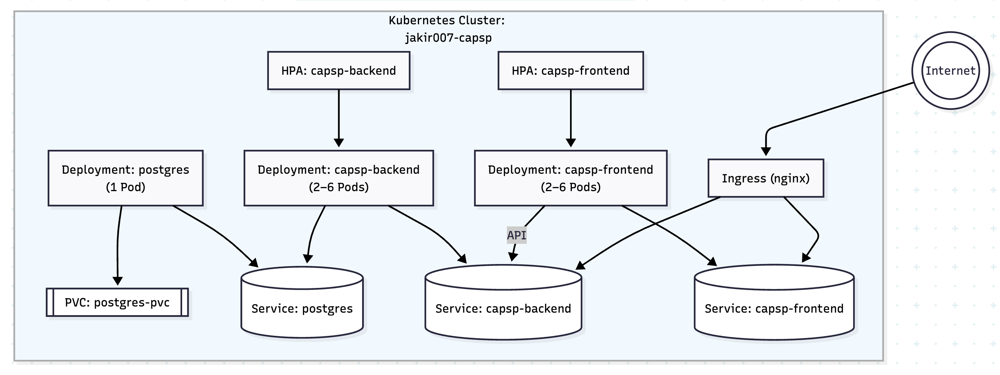

# Kubernetes Architecture – Finch Applications

## 1. Goals

- Deploy highly available, scalable frontend (Vue) and backend (Django) apps.
- Persist backend data using PostgreSQL (with a Persistent Volume).
- Expose services securely via NGINX Ingress Controller.
- Autoscale based on CPU load via Horizontal Pod Autoscalers (HPA).

## 2. Component Summary

| Component        | Kind(s)               | Scaling  | Persistent Storage | Publicly Exposed |
|------------------|------------------------|----------|--------------------|------------------|
| Frontend (Vue)   | Deployment, HPA        | 2–6 pods | No                 | Yes (via Ingress)|
| Backend (Django) | Deployment, HPA        | 2–6 pods | No                 | Yes (via Ingress)|
| PostgreSQL       | Deployment, PVC, SVC   | 1 pod    | Yes (5Gi PVC)      | No               |
| Ingress          | NGINX Ingress          | n/a      | No                 | Yes              |

## 3. Architecture Diagram

  

## 4. Resource Allocation

| Component   | CPU Requests | CPU Limits | Memory Requests | Memory Limits |
|-------------|--------------|------------|------------------|----------------|
| Frontend    | 100m         | 250m       | 128Mi            | 256Mi          |
| Backend     | 250m         | 500m       | 512Mi            | 1Gi            |
| PostgreSQL  | 250m         | 500m       | 512Mi            | 1Gi            |

## 5. Horizontal Pod Autoscalers (HPA)

- Triggers: CPU utilization above 70%
- Minimum replicas: 2
- Maximum replicas: 6

## 6. Persistent Volume

- `ReadWriteOnce` PVC for PostgreSQL: 5Gi capacity.
- Mounted at `/var/lib/postgresql/data` via `PGDATA` path.

## 7. Ingress Rules

- Host: `fs.jakirdev.com` → Frontend Service (`capsp-frontend`)
- Host: `finchback.jakirdev.com` → Backend Service (`capsp-backend`)
- TLS and certificate management via cert-manager (recommended for production).

## 8. Summary of Manifests

### Frontend
- Deployment with 2 replicas (HPA up to 6)
- ClusterIP Service
- NGINX container
- Exposed via Ingress

### Backend
- Django app using `newjakir/3-tire-back:latest`
- Liveness/readiness probes on `/login/`
- Accesses PostgreSQL via Service

### PostgreSQL
- Image: `postgres:15`
- Secrets provided via `capsp-env-secret`
- Data persistence via PVC (5Gi)

### Ingress
- Two hosts, each pointing to respective services
- Can include TLS annotations for HTTPS